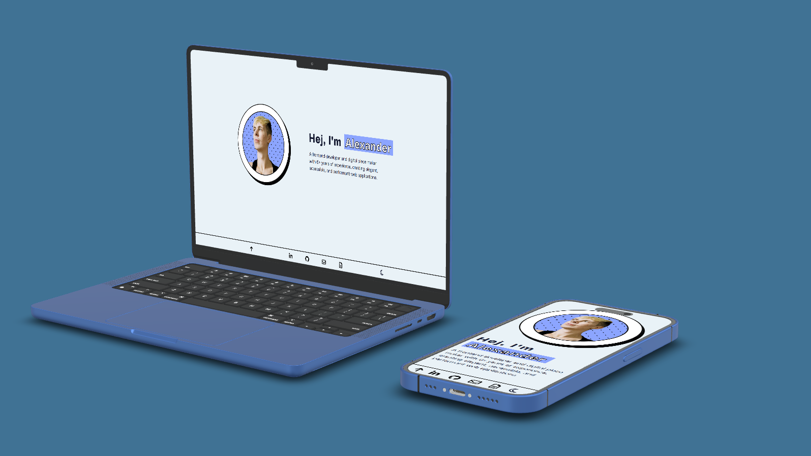
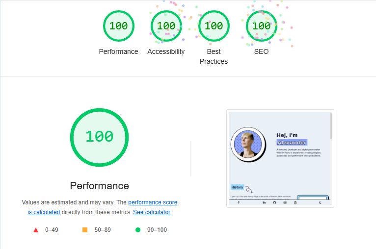

[![Vercel][vercel-shield]][vercel-url]
[![HTML 5][html5-shield]][html5-url]
[![CSS 3][css3-shield]][css3-url]
[![License][license-shield]][license-url]

<a id="readme-top"></a>

<!-- PROJECT LOGO -->
<br />
<div align="center">
  <a href="https://github.com/AlexanderVikenfalk/portfolio-2024">
    
  </a>

<h3 align="center">Portfolio</h3>

  <p align="center">
   Personal portfolio of frontend developer Alexander Vikenfalk.
    <br />
    <br />
    <a href="https://vikenfalk.com/">View Live</a>
  </p>
</div>


<!-- TABLE OF CONTENTS -->
<details>
  <summary>Table of Contents</summary>
  <ol>
    <li>
      <a href="#about-the-project">About The Project</a>
      <ul>
        <li><a href="#lighthouse-performance">Lighthouse Performance</a></li>
        <li><a href="#built-with">Built With</a></li>
        <li><a href="#deployed-with">Deployed With</a></li>
      </ul>
    </li>
    <li>
      <a href="#getting-started">Getting Started</a>
      <ul>
        <li><a href="#prerequisites">Prerequisites</a></li>
        <li><a href="#installation">Installation</a></li>
      </ul>
    </li>
    <li><a href="#roadmap">Roadmap</a></li>
    <li><a href="#license">License</a></li>
    <li><a href="#contact">Contact</a></li>
  </ol>
</details>


<!-- ABOUT THE PROJECT -->

## About The Project

<a href="https://vikenfalk.com/">

</a>

This portfolio was designed with a focused approach, adhering to several key principles:

* **KISS Principle:** Keep the design simple and straightforward
* **Quality Over Quantity:** Emphasize meaningful content and design
* **Technical Challenge:**: Develop the website using only HTML and CSS
* **Performance Optimization:** Achieve a 100-point Lighthouse score

The primary objectives were to:

* Showcase current professional skills
* Ensure optimal SEO performance
* Maintain high accessibility standards
* Create a performant, lightweight web experience

### Lighthouse Performance
Beneath you can see the end result of the light house report on mobile respective desktop mode.


|                   Desktop Lighthouse Score                   |                         Mobile Lighthouse Score                          |
|:------------------------------------------------------------:|:------------------------------------------------------------------------:|
|  |  |

### Built With

[![HTML 5][html5-shield]][html5-url]
[![CSS 3][css3-shield]][css3-url]

### Deployed With

[![Vercel][vercel-shield]][vercel-url]

<p align="right">(<a href="#readme-top">back to top</a>)</p>

## Getting Started

### Prerequisites

You will need a virtual server for the web page to display correctly. Here are some options:

* [NPM/ NPX http-server](https://www.npmjs.com/package/http-server)
* [Python http-server](https://developer.mozilla.org/en-US/docs/Learn/Common_questions/Tools_and_setup/set_up_a_local_testing_server#using_python)
* [WebStorm built in virtual server](https://www.jetbrains.com/help/webstorm/editing-html-files.html#ws_html_preview_output)

### Installation

1. Clone the repo
   ```sh
   git clone https://github.com/AlexanderVikenfalk/portfolio-2024.git
   ```
2. Start ```index.html``` using a <a href="#Prerequisites">virtual server</a>
3. Navigate to the served page in your web browser (this is done automatically if using
   WebStorm)

<p align="right">(<a href="#readme-top">back to top</a>)</p>

## Roadmap

- [x] Add lighthouse report screenshots to README
- [ ] Develop comprehensive project section
- [ ] Continuously update portfolio to reflect current skills and projects

<p align="right">(<a href="#readme-top">back to top</a>)</p>

## License

Distributed under the MIT License. See `LICENSE` for more information.

<p align="right">(<a href="#readme-top">back to top</a>)</p>

## Contact

**Linkedin:** [Alexander Vikenfalk](https://www.linkedin.com/in/alexander-vikenfalk/)

**Project Repository:** [GitHub Portfolio](https://github.com/AlexanderVikenfalk/portfolio-2024)


<p align="right">(<a href="#readme-top">back to top</a>)</p>


[license-shield]: https://img.shields.io/github/license/AlexanderVikenfalk/portfolio-2024.svg?style=for-the-badge

[license-url]: https://github.com/AlexanderVikenfalk/portfolio-2024/blob/main/LICENSE

[html5-url]: https://www.w3.org/html/

[html5-shield]: https://img.shields.io/badge/html5-%23E34F26.svg?style=for-the-badge&logo=html5&logoColor=white

[css3-url]: https://www.w3.org/Style/CSS/Overview.en.html

[css3-shield]: https://img.shields.io/badge/css3-%231572B6.svg?style=for-the-badge&logo=css3&logoColor=white

[vercel-url]: https://www.vercel.com

[vercel-shield]: https://deploy-badge.vercel.app/vercel/portfolio-2024-five-lime?style=for-the-badge


